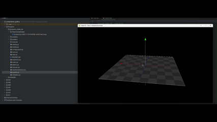
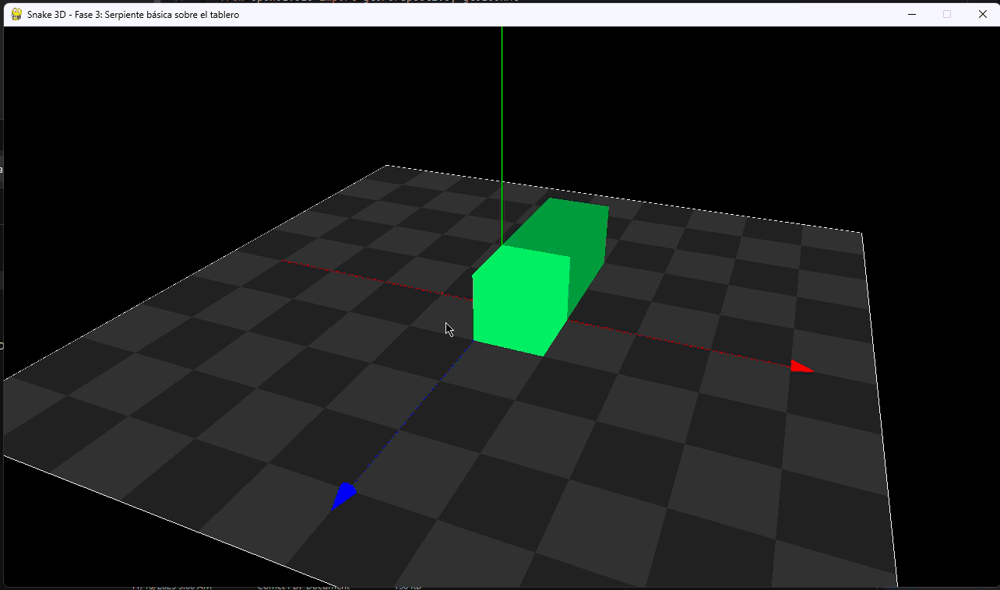

# Computación Gráfica

**Proyecto de la Asignatura - Avance de Proyecto**

# Juego Snake 3D

## Grupo 3

### Integrantes:

1. Yago Ramos Sánchez
2. Alan Ariel Salazar
3. Mario Tuset Gende
4. Miguel Ángel Lorenzo Fossati
5. Yésica Ramírez Bernal

---

## 1. Título

**Juego Snake 3D: Simulación Interactiva con Transformaciones Geométricas**

Tras una revisión inicial de la propuesta y el alcance del proyecto, confirmamos el título que mejor describe nuestra propuesta: un juego de la serpiente (Snake) en un entorno tridimensional donde el jugador controla el movimiento mediante el teclado y observa la escena desde diferentes perspectivas gracias a una cámara libre y en tercera persona. El énfasis está en la visualización tridimensional mediante transformaciones geométricas (rotaciones, traslaciones y escalados) aplicadas sobre primitivas básicas, más que en una simulación física realista del movimiento.

---

## 2. Resumen

Durante esta fase inicial del proyecto, hemos llevado a cabo un análisis de las herramientas y técnicas disponibles para el desarrollo de aplicaciones gráficas interactivas en 3D. Hemos evaluado diferentes enfoques de renderizado disponibles en el contexto de la asignatura, comparando el pipeline moderno con shaders personalizados (GLSL) frente al pipeline fijo tradicional de OpenGL utilizando VBOs (Vertex Buffer Objects).

Como resultado de esta evaluación, hemos determinado que el pipeline moderno con shaders es la opción más adecuada para nuestro proyecto, ya que nos permite un mayor control sobre el renderizado, mejor rendimiento cuando manejamos múltiples objetos en escena, y una mayor flexibilidad para futuras mejoras y efectos visuales. Esta decisión se fundamenta en las características específicas de nuestro juego, donde necesitamos renderizar múltiples segmentos de serpiente que cambian dinámicamente, objetos de comida que aparecen y desaparecen, y un tablero tridimensional, todo ello actualizándose en tiempo real.

Hemos comenzado a establecer la estructura base del código, aprovechando los materiales y ejemplos proporcionados en las sesiones prácticas de la asignatura, específicamente basándonos en la carpeta SHADER de la sesión 11 correspondiente al tema 3.5. Las razones detalladas de esta decisión técnica se explican en la sección de Metodología.

---

## 3. Objetivos

### Objetivo General

El objetivo general del proyecto es crear una escena interactiva donde una serpiente formada por segmentos geométricos se mueva sobre un tablero tridimensional, recoja objetos (por ejemplo, puntos o cuadrados) y aumente su longitud progresivamente mediante transformaciones geométricas 3D controladas por el usuario.

### Objetivos Específicos

1. **Implementación del entorno 3D**: Crear un tablero tridimensional visible que sirva como área de juego, utilizando primitivas básicas y transformaciones geométricas.

2. **Modelado de la serpiente**: Desarrollar una representación de la serpiente mediante segmentos geométricos que puedan moverse, rotarse y trasladarse en el espacio 3D. El movimiento no necesita ser físicamente realista, sino que se enfocará en representar visualmente el desplazamiento mediante transformaciones controladas.

3. **Sistema de control**: Implementar un sistema de entrada mediante teclado que permita al jugador controlar la dirección de movimiento de la serpiente en el espacio 3D.

4. **Sistema de cámara**: Desarrollar una cámara interactiva que permita al jugador observar la escena desde diferentes ángulos, incluyendo modos de cámara libre y en tercera persona, controlable mediante teclado y/o ratón.

5. **Sistema de recolección**: Implementar objetos de comida que aparezcan en el tablero, puedan ser detectados cuando la serpiente los recoja, y provoquen el crecimiento de la serpiente.

6. **Mecánica de crecimiento**: Hacer que la serpiente aumente su longitud progresivamente mediante la adición de nuevos segmentos geométricos cuando se recojan objetos de comida.

7. **Renderizado en tiempo real**: Asegurar que toda la escena se actualice y renderice correctamente en tiempo real, mostrando los cambios dinámicos en la serpiente y el entorno.

### Ajustes y Precisiones

Tras la evaluación inicial, hemos precisado que:

- No buscamos una simulación física realista del movimiento de una serpiente, sino una representación visual mediante transformaciones geométricas simples.
- El enfoque principal está en las transformaciones 3D (rotación, traslación, escalado) aplicadas a primitivas geométricas básicas.
- La cámara será completamente funcional pero puede simplificarse en comparación con sistemas de cámaras más complejos, priorizando la usabilidad para el juego.

---

## 4. Metodología

### Enfoque de Desarrollo

Nuestro proyecto sigue una metodología incremental e iterativa, donde comenzamos con componentes básicos y vamos añadiendo funcionalidades de manera progresiva. Esta aproximación nos permite validar cada parte del sistema antes de integrarla con el resto de componentes.

### Tecnologías y Herramientas

**Lenguaje y Bibliotecas Principales:**
- **Python 3**: Lenguaje de programación principal
- **Pygame**: Para la gestión de ventanas, eventos de entrada (teclado, ratón) y el bucle principal de la aplicación
- **OpenGL**: Para el renderizado 3D y la gestión de gráficos
- **PyOpenGL**: Binding de Python para OpenGL
- **NumPy**: Para operaciones matemáticas y manejo de matrices y vectores en las transformaciones geométricas
- **GLSL**: Lenguaje de shaders para programar el pipeline de renderizado en la GPU

**Enfoque de Renderizado: Pipeline Moderno con Shaders**

Tras analizar las opciones disponibles en el contexto de la asignatura, específicamente las carpetas SHADER y VBOs proporcionadas en las sesiones prácticas, hemos decidido utilizar el **pipeline con shaders personalizados** (carpeta SHADER de la sesión 11, tema 3.5) en lugar del pipeline fijo tradicional con VBOs. Esta decisión se fundamenta en las siguientes consideraciones técnicas:

1. **Rendimiento con múltiples objetos dinámicos**: El pipeline moderno con shaders nos permite un renderizado más eficiente cuando manejamos muchos objetos que cambian constantemente, lo cual es esencial para nuestro juego con segmentos de serpiente que crecen dinámicamente.

2. **Flexibilidad para transformaciones**: Nos da control total sobre cómo se aplican las transformaciones (modelo, vista, proyección) mediante matrices que se pasan como uniforms a los shaders, esencial para las transformaciones geométricas 3D continuas de cada segmento.

3. **Escalabilidad y extensibilidad**: Proporciona la base necesaria para hacer mejoras visuales sin tener que cambiar completamente la arquitectura.

4. **Control sobre la iluminación**: Los shaders personalizados permiten implementar iluminación de manera programable, mejorando la percepción de profundidad y distinción de objetos en el juego 3D.


**Comparación con el enfoque alternativo:**

El pipeline fijo con VBOs sería más simple de implementar inicialmente y utiliza funciones tradicionales de OpenGL. Sin embargo, este enfoque está limitado en términos de flexibilidad y rendimiento cuando se trabaja con muchas primitivas que cambian dinámicamente. Además, el pipeline fijo está deprecado en versiones modernas de OpenGL (Core Profile), y aunque funcione en versiones antiguas, el conocimiento sobre shaders es más valioso a largo plazo.

### Estructura del Código

Basándonos en la estructura de la carpeta SHADER, planteamos la siguiente organización de nuestro proyecto:

```
proyecto_snake_3d/
│
├── main.py                 # Punto de entrada principal, bucle del juego, gestión de eventos
├── configuracion.py        # Constantes y configuraciones (resolución, FPS, colores, etc.)
├── camara.py               # Clase para gestión de la cámara (libre y tercera persona)
├── snake.py                # Clase principal de la serpiente (segmentos, movimiento, crecimiento)
├── segmento.py             # Clase para representar cada segmento individual de la serpiente
├── tablero.py              # Clase para el tablero 3D y gestión de posiciones
├── comida.py               # Clase para objetos de comida (generación, detección de colisiones)
├── transformaciones.py     # Funciones auxiliares para transformaciones geométricas 3D
├── texturas.py             # Carga y gestión de texturas para los objetos
├── luces.py                # Configuración de iluminación (clase Iluminacion para shaders)
├── utilidades.py           # Funciones auxiliares (dibujado de ejes, rejillas, etc.)
├── usuario.py              # Procesamiento de eventos de entrada (teclado, ratón)
│
├── shaders/
│   ├── vertex_shader.glsl  # Shader de vértices para transformaciones y paso de datos
│   └── fragment_shader.glsl # Shader de fragmentos para iluminación y colores
│
├── modelos/                # Modelos 3D en formato .obj (si los utilizamos)
│   └── (cubo.obj, esfera.obj, etc.)
│
└── texturas/               # Archivos de texturas
    └── (texturas para objetos del juego)
```

**¿Qué buscamos de esta estructura?**

- **Separación de responsabilidades**: Cada archivo tiene una responsabilidad clara y específica, lo que facilita el mantenimiento y la colaboración entre miembros del grupo.

- **Modularidad**: La estructura es modular, permitiendo que cada componente (serpiente, tablero, comida, cámara) se desarrolle y pruebe de forma independiente antes de integrarse.

- **Reutilización**: Utilizamos las clases y funciones existentes de la carpeta SHADER base (como `camara.py`, `transformaciones.py`, `utilidades.py`) y las extendemos y/o adaptamos para nuestras necesidades.

- **Mantenibilidad**: Al seguir una estructura similar a los ejemplos proporcionados, cualquier miembro del equipo puede entender y trabajar con el código más fácilmente.

### Flujo de Desarrollo

1. **Fase 0 - Entorno**: Configuraremos nuestro IDE instalando las dependencias necesarias y crearemos los directorios y archivos mencionados, utilizaremos GIT para tener un versionado del codigo y tener una trazabilidad clara.

2. **Fase 1 - Base y Entorno**: Configuración inicial del entorno 3D, carga de shaders, configuración de cámara básica, y renderizado de primitivas simples (cubo, esfera) para validar el pipeline.

3. **Fase 2 - Tablero y Espacio de Juego**: Implementación del tablero tridimensional visible y sistema básico de posicionamiento en el espacio 3D.

4. **Fase 3 - Serpiente Básica**: Creación de la clase `Segmento` y `Snake`, renderizado de un segmento simple que pueda trasladarse en el espacio.

5. **Fase 4 - Movimiento y Control**: Implementación del sistema de control mediante teclado y lógica de movimiento de la serpiente con transformaciones geométricas.

6. **Fase 5 - Sistema de Comida**: Implementación de objetos de comida que aparecen en el tablero y detección de colisiones cuando la serpiente los recoje.

7. **Fase 6 - Crecimiento y Mecánicas**: Implementación del sistema de crecimiento de la serpiente y mecánicas de juego básicas.

8. **Fase 7 - Cámara Interactiva**: Mejora del sistema de cámara para incluir modos libre y tercera persona, con controles intuitivos.

9. **Fase 8 - Pulido y Optimización**: Ajustes visuales, optimización de rendimiento, y pruebas finales.

### Técnicas y Conceptos Aplicados

- **Shader Programming**: Programación en GLSL para vertex y fragment shaders, manejo de uniforms y atributos.
- **VBOs (Vertex Buffer Objects)**: Para almacenar datos de vértices en la GPU y optimizar el renderizado. Técnica complementaria a los shaders (los shaders procesan los datos almacenados en los VBOs).
- **Sistema de Coordenadas 3D**: Manejo de coordenadas en el espacio 3D y transformaciones entre sistemas de coordenadas.
- **Colisiones Básicas**: Detección de intersecciones entre la serpiente y objetos de comida, y con los límites del tablero.
- **Programación Orientada a Objetos**: Uso de clases para modelar los componentes del juego.

---

## 5. Desarrollo y Avances del Proyecto

En esta primera iteración nos hemos centrado en sentar una base sólida reutilizando la
infraestructura del proyecto de referencia `SHADER` y adaptándola a la estructura del
Snake 3D. Hemos preferido avanzar por capas, empezando por todo lo que tiene que ver con
ventana, cámara y escena básica, antes de entrar en la lógica propia del juego.

### Fase 0 - Creación de estructura y configuración común

Empezamos creando la estructura de directorios que definimos en la sección de Metodología
(`proyecto_snake_3d/` con sus módulos principales, carpeta de shaders y carpeta de texturas)
y, a partir de ahí, trasladamos la configuración global desde `SHADER/configuracion.py` a
`configuracion.py` del proyecto Snake. En esta copia aprovechamos para añadir algunas
constantes lógicas del juego (tamaño del tablero en celdas y tamaño de cada celda) que
usaremos más adelante cuando implementemos el tablero y el movimiento de la serpiente.

En paralelo portamos también los módulos de infraestructura gráfica que no dependen aún de
la lógica del juego: `camara.py`, `transformaciones.py`, `texturas.py`, `luces.py`,
`utilidades.py` y `usuario.py`. La idea ha sido mantener el comportamiento probado de
SHADER (cámara orbital, carga de texturas, iluminación básica y elementos auxiliares de
dibujo), pero documentando el código desde la perspectiva del Snake 3D y dejando claro que
estas piezas se usarán como base para las fases posteriores.

#### Módulos portados y adaptados desde `SHADER`

En esta fase hemos creado y adaptado varios módulos clave tomando como referencia directa
el proyecto `SHADER`:

- `configuracion.py`: centralizamos constantes de ventana, proyección, cámara, ejes y
  rejilla, y añadimos parámetros lógicos del tablero (`TABLERO_ANCHO`, `TABLERO_LARGO`,
  `TAMANO_CELDA`, etc.) pensando ya en cómo se va a mover la serpiente sobre un espacio
  discreto pero representado en 3D.
- `camara.py`: implementamos una cámara orbital basada en `SHADER/camara.py`, con `pitch`,
  `yaw`, `roll` y `radio`, además de métodos de ajuste y presets (`reset`, `set_capture`)
  orientados a explorar el tablero del Snake 3D de forma cómoda.
- `transformaciones.py`: reutilizamos las funciones `trasladar`, `rotar`, `escalar` y
  `transformar` de `SHADER/transformaciones.py` como capa auxiliar para aplicar
  transformaciones 3D a los objetos del juego.
- `texturas.py`: mantenemos una función `cargar_textura` que usa Pygame y OpenGL para
  registrar texturas 2D, lista para asociarla más adelante al tablero, la serpiente y la
  comida.
- `luces.py`: definimos la clase `Iluminacion`, encargada de configurar los uniforms de
  iluminación en los shaders (`lightPos`, `viewPos`, `lightAmbient`, etc.), siguiendo la
  misma filosofía que en `SHADER/luces.py`.
- `utilidades.py`: agrupamos el dibujado de ejes y rejilla (`dibujar_elementos_auxiliares`,
  `dibujar_ejes`, `dibujar_rejilla`, …) reutilizando la idea de `SHADER/utilidades.py` pero
  apoyándonos en las constantes de `configuracion.py`.
- `usuario.py`: trasladamos la lógica de entrada para la cámara
  (`procesar_eventos_raton`, `consultar_estado_teclado`), prácticamente igual que en
  `SHADER/usuario.py`, y la dejamos preparada para ampliarla más adelante con los controles
  propios de la serpiente.

### Fase 1 - Ventana, cámara orbital y escena base

Con la infraestructura lista, montamos el primer `main.py` funcional del proyecto. Aquí
configuramos la ventana de Pygame con contexto OpenGL, aplicamos la proyección en
perspectiva y creamos una cámara orbital inicial (ligeramente inclinada y mirando al
origen), reutilizando la clase `Camara` que acabábamos de portar. Sobre esta configuración
dibujamos únicamente los ejes de coordenadas y una rejilla en el plano XZ usando
`utilidades.py`, lo suficiente para validar que la cámara responde bien tanto al ratón como
al teclado.

Esta escena base nos deja ya un esqueleto claro de bucle principal (`bucle_principal` en
`main.py`) que más adelante utilizaremos para integrar el tablero, la serpiente y los
objetos de comida. A partir de aquí, el siguiente paso natural será centrar la Fase 2 en el
diseño del tablero tridimensional y su mapeo a coordenadas lógicas de juego.

Para dejar constancia visual de esta fase:


### Fase 2 - Tablero 3D y sistema básico de posicionamiento

En la segunda fase nos hemos centrado en sustituir la rejilla genérica de depuración por un
tablero 3D real, con las mismas dimensiones lógicas que usaremos más adelante para el
movimiento de la serpiente. La idea es que lo que vemos en pantalla ya represente el área
de juego real, no sólo una referencia visual abstracta.

Para ello creamos el módulo `tablero.py` con la clase `Tablero`, que toma como referencia
las constantes `TABLERO_ANCHO`, `TABLERO_LARGO` y `TAMANO_CELDA` definidas en
`configuracion.py`. El tablero se construye centrado en el origen del espacio 3D y cada
celda se dibuja como un quad en el plano XZ, alternando dos colores (`COLOR_TABLERO_BASE`
y `COLOR_TABLERO_ALT`) para que se distinga bien la estructura en cuadrícula. Además,
añadimos un borde (`COLOR_TABLERO_BORDE`) que marca de forma clara los límites del área
jugable.

Al mismo tiempo definimos en `Tablero` un método `obtener_posicion_mundo(celda_x, celda_z)`
que nos devuelve la posición central de cualquier celda en coordenadas del mundo. Con esto
dejamos resuelto el mapeo entre índices discretos de tablero (0..ancho-1, 0..largo-1) y
posiciones 3D, que es justo lo que necesitaremos cuando la serpiente empiece a moverse.

Por último, actualizamos `main.py` para instanciar un `Tablero` y dibujarlo en cada frame
dentro de `renderizar`, manteniendo los ejes como referencia pero desactivando la rejilla
auxiliar. De esta forma, la escena que vemos ahora ya es el tablero definitivo del Snake 3D
sobre el que construiremos las siguientes fases (serpiente, comida y colisiones).

Para ilustrar visualmente el resultado de esta fase, hemos generado un GIF que recoge el
estado del proyecto hasta la Fase 2:



### Fase 3 - Serpiente básica sobre el tablero

En la tercera fase empezamos por fin a dar forma a la serpiente, aunque todavía sin
movimiento. Lo que buscamos aquí es tener una representación clara, apoyada en el tablero
que ya teníamos, y comprobar que el modelo de datos encaja bien con el sistema de
coordenadas por celdas.

Por un lado definimos el módulo `segmento.py`, donde implementamos la clase `Segmento`. Cada
segmento guarda su posición en coordenadas lógicas de tablero (`celda_x`, `celda_z`) y un
color propio. Para dibujarlo, pedimos al `Tablero` la posición central de su celda mediante
`obtener_posicion_mundo` y usamos las funciones de `transformaciones.py` para colocar y
escalar un cubo unitario sobre esa posición. El cubo queda ligeramente elevado respecto al
plano del tablero para que visualmente se entienda que “descansa” encima de él y no se
mezcla con la textura del suelo.

Por otro lado creamos la clase `Snake` en `snake.py`. En esta fase la serpiente es simplemente
una lista de `Segmento`: generamos una pequeña cadena de tres segmentos, con la “cabeza” en
el centro del tablero y el resto del cuerpo alineado detrás en el eje Z. Aprovechamos para
introducir dos colores nuevos en `configuracion.py` (`COLOR_SERPIENTE_CABEZA` y
`COLOR_SERPIENTE_CUERPO`), de forma que visualmente se distinga el primer segmento del resto,
aunque todavía no se esté moviendo.

Finalmente, actualizamos `main.py` para instanciar una `Snake` junto con el `Tablero` e
integrarla en la función `renderizar`. Ahora, además del tablero y los ejes auxiliares, la
escena muestra esta serpiente estática colocada correctamente sobre el área de juego. En la
próxima fase utilizaremos esta base para darle movimiento real y empezar a trabajar con la
lógica de control y colisiones.

Para ilustrar visualmente el resultado de esta fase tenemos el siguiente gif:



---

## 6. Próximos Pasos

*[Esta sección se actualizará con las actividades planificadas y objetivos concretos hasta la entrega final del proyecto. Incluirá un cronograma de trabajo, tareas asignadas a cada miembro del equipo, y hitos importantes.]*

---

## 7. Bibliografía Preliminar

*[Esta sección se completará con las referencias bibliográficas consultadas durante el desarrollo del proyecto, en formato APA 7. Incluirá libros, artículos, documentación oficial, tutoriales y cualquier otra fuente utilizada.]*

---

**Última actualización**: 16 de Noviembre
